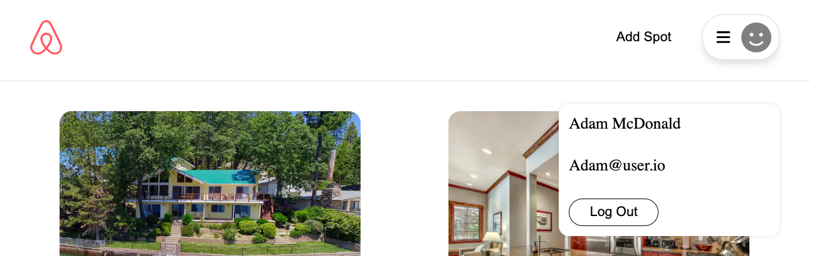
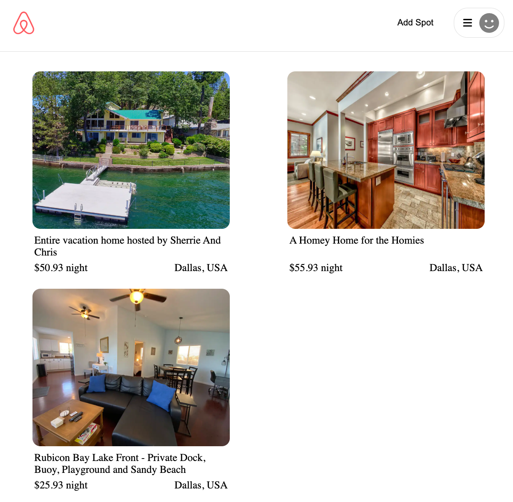

# Welcome to my AirBnB Clone

For this project, we were tasked with building a fullstack project to replicate our chosen websites. My selection was Airbnb, although still a working progress, I am proud to display my first fullstack project.
<br/>
<br/>
Explore my AirBnB Clone Site: [ Airbnb Clone ](https://theo-airbnb-fullstack.herokuapp.com/)

<br/>

## Setup:

---

<br/>

1. Clone Locally

```
git clone https://github.com/theoman42/airbnb2.0.git
```

<br/>

2. Create a .env file in the backend directory

- PORT= The Port the backend will run on.
- DB_FILE= Location of the database file
- JWT_SECRET= JWT Secret Key
- JWT_EXPIRES_IN= Period JWT Key is active before expiry

<br/>

3. Open up your project in VScode or any development environment and run the following command in the frontend, backend and the root directoy.

```
npm install
```

<br/>

4. Once all dependencies are loaded, start both the backend and front end servers with the following command:

```
npm start
```

<br/>

## Technologies:

---

- JavaScript
- HTML
- CSS
- React
- Redux
- Node.js
- Express.js
- Sequelize
- Sqlite3
- Heroku
- AWS

<br/>

## Site Overview

---

<br/>

### Navigation:

The Navigation bar includes a logo, a demo login button, and a profile drop down menu. The drop down menu includes a login and signup button when logged out. On signin, this portion will display user information as well as a logout button. When loggged in, the demo button will switch to an add spot button.



<br/>
<br/>

### Landing Page:

The landing page displays all available spots as well as their Name, Price, and location. Each individual spot will link you to their respective spot pages.



<br/>
<br/>

### Spots Page:

This page displays a title, description, image, and reviews for a given spot. If the user is the owner of the spot and is logged in, the user will have the ability to edit and delete the spot from this page. The owner of the spot may not leave a review on their own spot. Owners of a review for a specific spot will be able to delete and edit their review for a given spot. No more than one review per spot!


<br/>
<br/>

## Features

---

<br/>

### Primary Project Features:

1. Login a user
1. Signup a user
1. Login as a demo user
1. Create a spot
1. Retrieve all spots
1. Edit a spot
1. Delete a spot.
1. Create a review
1. Retrieve all reviews
1. Edit a review
1. Delete a review

<br/>

### Secondary Features

Modals were implemented for all forms in order to showcase the intuitive superiority of these user interfaces.

<br/>
<br/>
